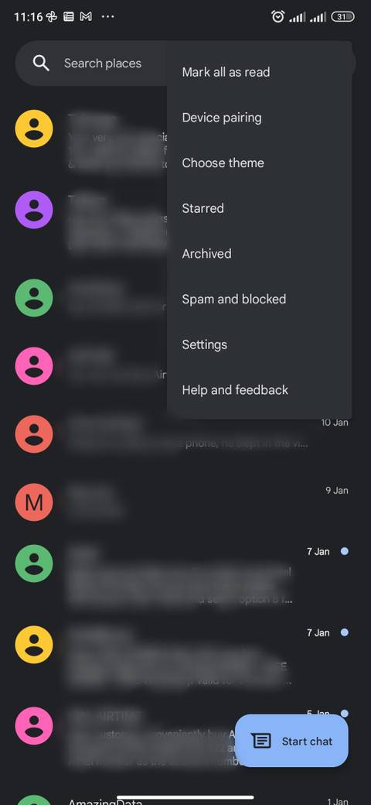
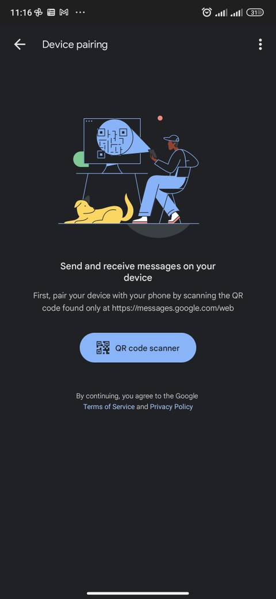
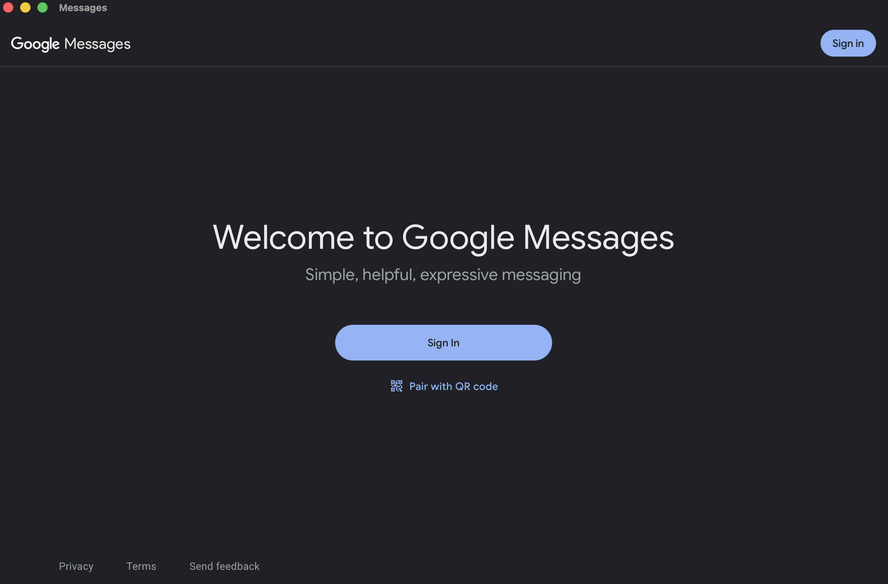

# messages-desktop


Google Messages desktop app for macOS, powered by Tauri and WebKit.

## What it does

This app wraps [messages.google.com/web](https://messages.google.com/web) in a native macOS window. It lets you send and receive SMS and RCS messages from your Mac, using your Android phone as the connection point.

There is very little code in this project. The app opens a WebView that loads the official Google Messages website. No data passes through any third-party server.

## How to connect your phone

1. Open the app.
2. On your Android phone, open the **Messages** app.
3. Tap the menu (three dots) and select **Device Pairing**.

<p align="center">
  
  
</p>

4. Scan the QR code shown in the app.

<p align="center">
  
</p>

That's it. Your messages will appear and sync in real time.

## Why email/password login does not work

Google blocks password entry in embedded web views (like the one Tauri uses). This is a deliberate security policy from Google, designed to prevent phishing attacks where a fake app captures your credentials.

This app does not try to work around that restriction. The QR code pairing flow does not require a Google account login — it connects directly to your phone — so it works fine and is the intended way to use Google Messages on a computer anyway.

## Build

Requirements: [Rust](https://rustup.rs), [Node.js](https://nodejs.org), [Task](https://taskfile.dev).

```bash
task package   # builds the .dmg
```

---

## macOS: "Messages is damaged and can't be opened"

This warning comes from macOS Gatekeeper, not from the app itself. Gatekeeper blocks any application that is not signed with an Apple Developer certificate ($99/year). When you download the .dmg from the internet, your browser adds a quarantine flag to the file, and macOS refuses to open it.

The app works perfectly fine — it is just not code-signed.

To fix it, open a terminal and run:

```bash
xattr -cr /Applications/Messages.app
```

Then open the app normally. You only need to do this once.
